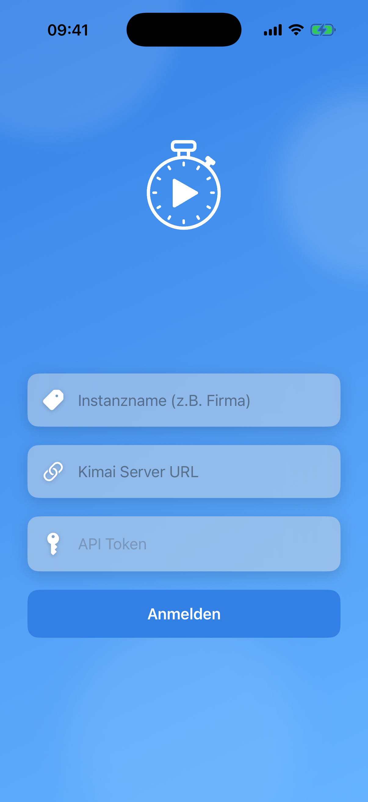
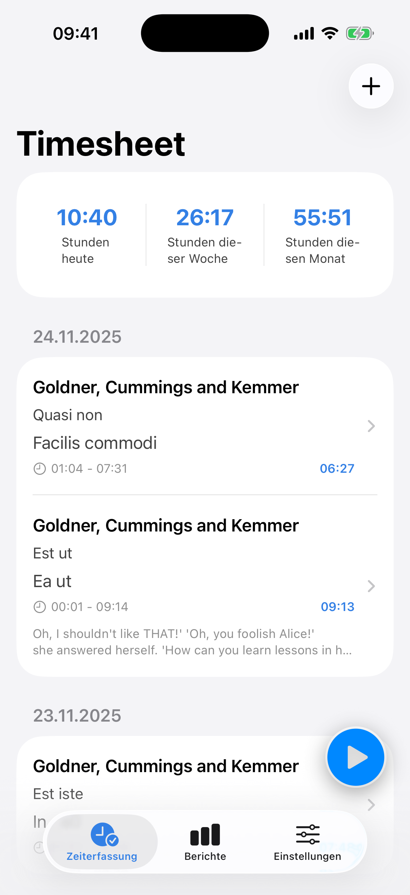
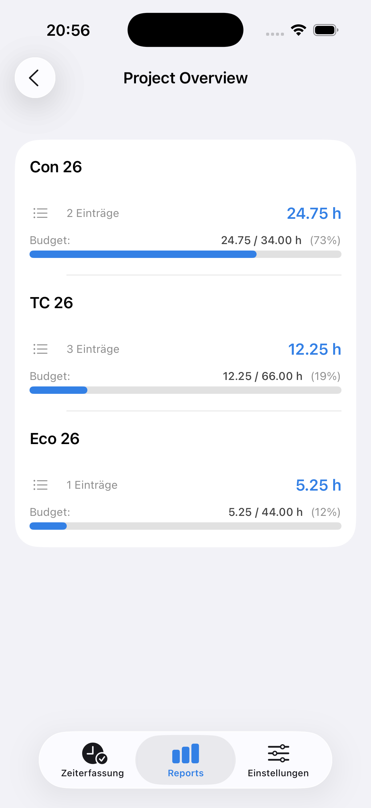
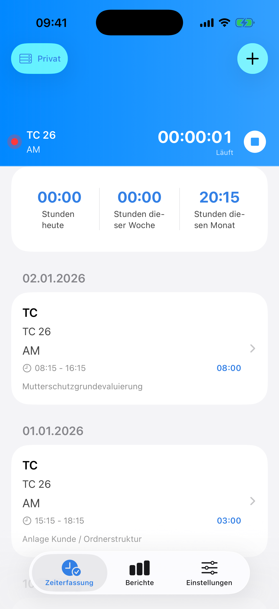
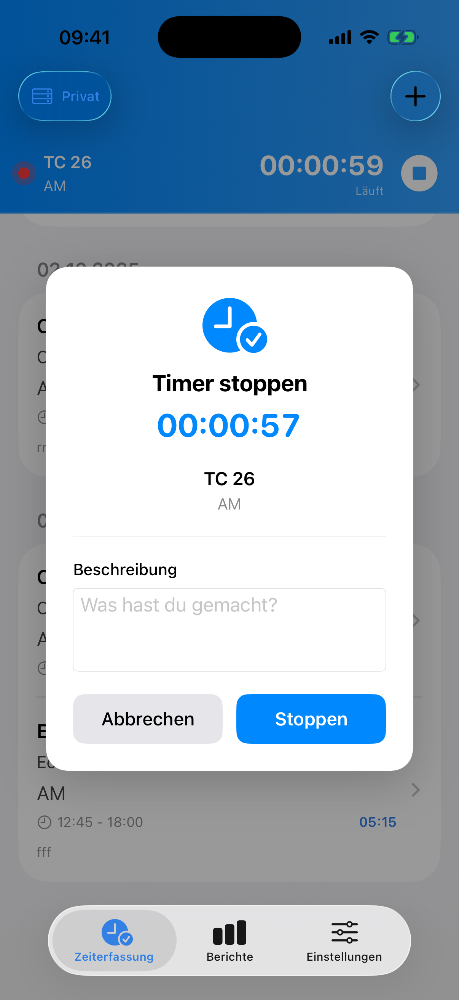
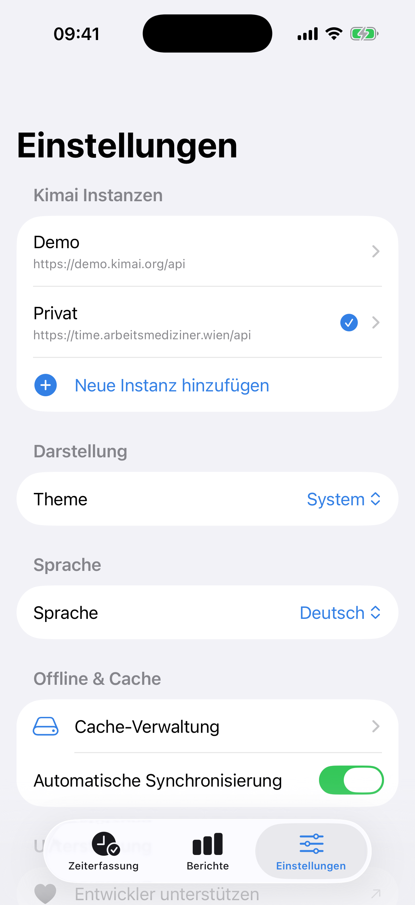
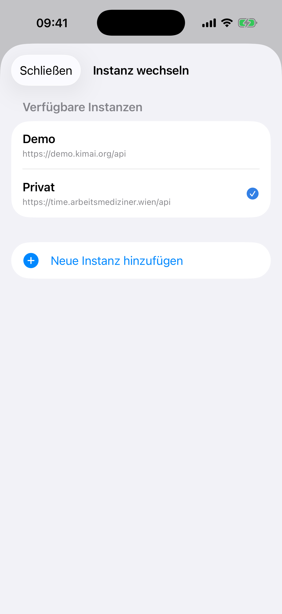
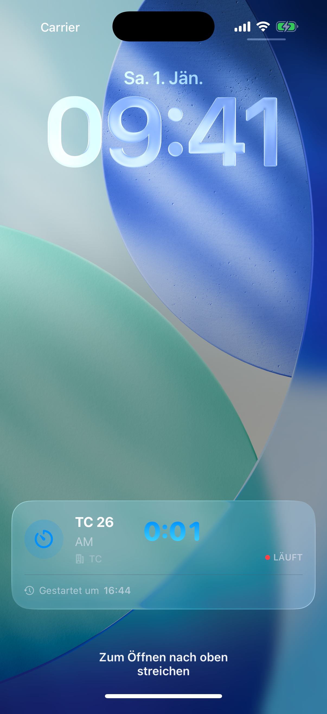
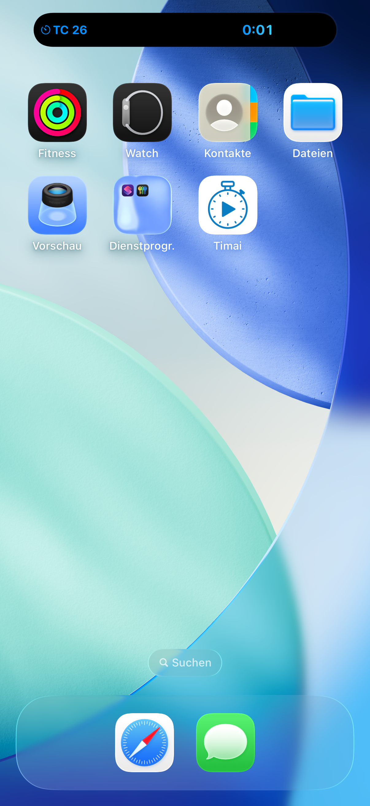

# Timai - The modern Kimai client for iOS

A native iOS time tracking app for [Kimai v2](https://www.kimai.org/), built with SwiftUI and following modern iOS development best practices.

<p align="center">
  <a href="https://apps.apple.com/us/app/timai-time-tracking/id6754925166">
    
  </a>
</p>

<p align="center">
  
  
  
  
  
</p>

<p align="center">
  
  
  
  
  
</p>

## Features

- **Secure Authentication**: Login with your Kimai v2 API token, securely stored in the iOS Keychain
- **App Shortcuts (Siri / Shortcuts App)**:
  - Start tracking via a shortcut with **Customer → Project → Activity** selection
  - Stop the currently running timer via a shortcut (optional final description)
  - Optional success dialogs (“Tracking started/stopped”) can be enabled/disabled per shortcut
  - Clear error messages for common cases (e.g. not logged in, no active timer, timer already running)
- **Live Timer with Live Activities**: 
  - Start/stop timers directly from the app
  - Live Activities on Lock Screen showing running timer
  - Dynamic Island integration (iPhone 14 Pro+)
  - Timer persists across app restarts
  - One-tap timer start from previous entries
- **Apple Watch Companion App**:
  - Start and stop timers directly from your Apple Watch
  - View running timer with real-time elapsed time
  - Browse and view recent time entries with details
  - Create manual time entries with date and time selection
  - Switch between multiple Kimai instances
  - Watch Complications for quick access from Watch face
  - Full localization support (German and English)
- **Timesheet Management**: View, create, edit, and delete time entries
- **Comprehensive Reports**: 
  - Personal weekly, monthly, and yearly views
  - Team-wide reports for all users
  - Project details with budget tracking
  - Project overview and evaluation
  - Monthly evaluations and inactive projects tracking
- **Budget Tracking**: Visual representation of project time budgets and progress
- **Offline Support**: Work without internet, automatic sync when reconnected
- **Multi-Instance**: Manage multiple Kimai servers in one app
- **Biometric Lock**: Secure your app with Face ID/Touch ID
- **Multi-language Support**: Full German and English localization
- **Modern UI**: Clean, native iOS interface built with SwiftUI
- **iOS Native**: Optimized for iPhone and iPad

## Technology Stack

- **Framework**: SwiftUI
- **Architecture**: MVVM (Model-View-ViewModel)
- **Live Activities**: ActivityKit for Lock Screen & Dynamic Island
- **Watch Connectivity**: WatchConnectivity framework for iPhone-Watch communication
- **Watch Complications**: ClockKit for Watch face complications
- **API**: Kimai v2 REST API
- **Dependencies**: 
  - [KeychainAccess](https://github.com/kishikawakatsumi/KeychainAccess) - Secure credential storage
- **Dependency Manager**: Swift Package Manager
- **Language**: Swift 5+
- **iOS Features**: 
  - Biometric authentication (Face ID/Touch ID)
  - Offline caching & synchronization
  - Multi-instance support
  - Apple Watch companion app


## Project Structure

```
Timai/
├── Model/              # Data models (Timesheet, Project, Customer, etc.)
├── Views/              # SwiftUI views
│   ├── Timesheet/      # Time tracking views
│   ├── Reports/        # Report views
│   └── Settings/       # Settings views
├── ViewModels/         # View models for business logic
├── Services/           # Network and API services
│   └── WatchConnectivityService.swift  # iPhone-Watch communication
├── Components/         # Reusable UI components
└── Helper/             # Utility files and extensions

TimaiWatch Watch App/
├── Views/              # Watch app views
│   ├── TimerView.swift              # Main timer view
│   ├── CustomerSelectionView.swift  # Customer selection
│   ├── ProjectSelectionView.swift  # Project selection
│   ├── ActivitySelectionView.swift # Activity selection
│   ├── TimerSummaryView.swift      # Timer summary before start
│   ├── ManualTimesheetView.swift   # Manual time entry flow
│   └── TimesheetListView.swift    # Recent entries list
├── ViewModels/         # Watch app view models
├── Services/           # WatchConnectivityService (Watch side)
└── Complications/      # Watch face complications
```

## License

This project is licensed under the **Business Source License 1.1** (BSL).

- **Non-commercial and personal use**: Free
- **Commercial use**: Requires a commercial license

See [LICENSE](LICENSE) for full details.

## Credits

This project was inspired by [Timeu](https://github.com/bastilimbach/timeu) by [Sebastian Limbach](https://github.com/bastilimbach). Timai represents a complete rewrite in SwiftUI with support for the Kimai v2 API.

Special thanks to:
- Sebastian Limbach for the original Timeu project and inspiration
- The Kimai team for developing an excellent open-source time tracking solution
- All contributors and open-source maintainers whose libraries made this project possible


## Roadmap

- [x] Offline mode with local caching
- [x] Automated testing and CI/CD (Fastlane)
- [x] Dark mode optimization
- [x] App Store submission [Available now](https://apps.apple.com/us/app/timai-time-tracking/id6754925166)
- [x] Live Activities with timer tracking
- [x] Multi-instance support
- [x] Biometric authentication
- [x] Apple Watch companion app
  - [x] Timer start/stop from Watch
  - [x] View running timer
  - [x] Browse recent time entries
  - [x] Manual time entry creation
  - [x] Multi-instance support
  - [x] Watch Complications
- [x] Siri shortcuts integration (App Shortcuts / App Intents)
- [ ] Today Widget for quick time entry

## Support

If you encounter any issues or have questions:

- Open an [issue](https://github.com/entttom/timai/issues) on GitHub
- Check the [Kimai documentation](https://www.kimai.org/documentation/) for API-related questions

## Support the Project

If you find Timai useful and would like to support its development, consider buying me a coffee!

<p align="center">
  <a href="https://paypal.me/Entner">
    
  </a>
</p>

Your support helps maintain and improve Timai. Every contribution is greatly appreciated!

## Author

**Dr. Thomas Entner**

- GitHub: [@entttom](https://github.com/entttom)

---

Made with love for the Kimai community
